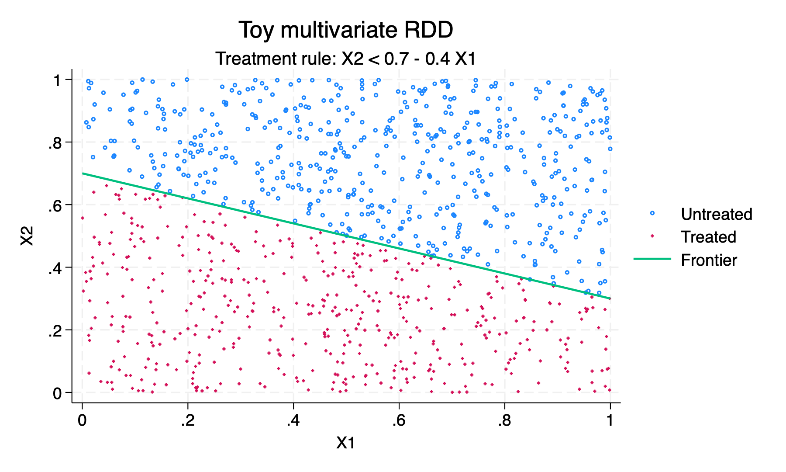
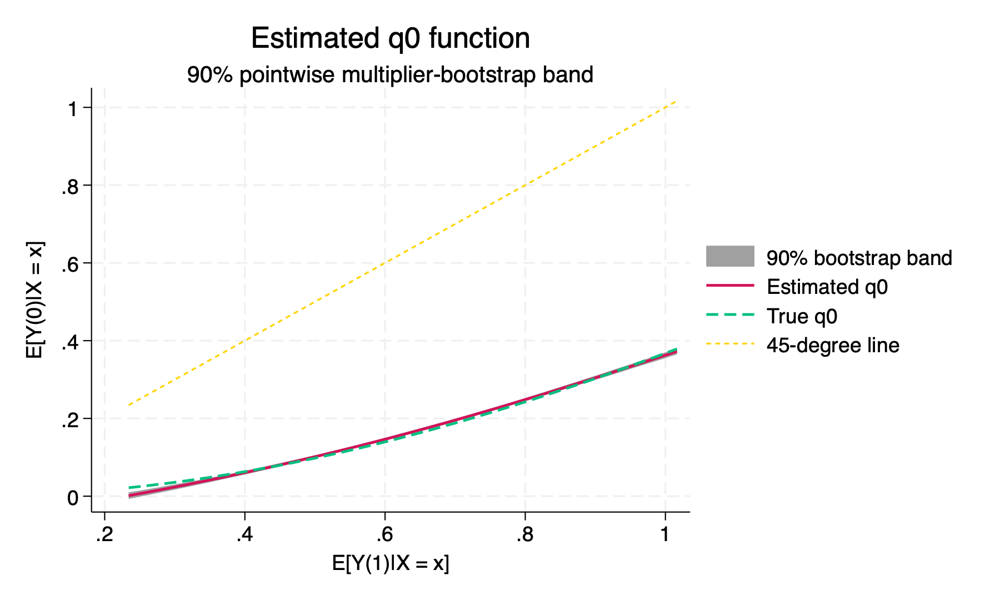
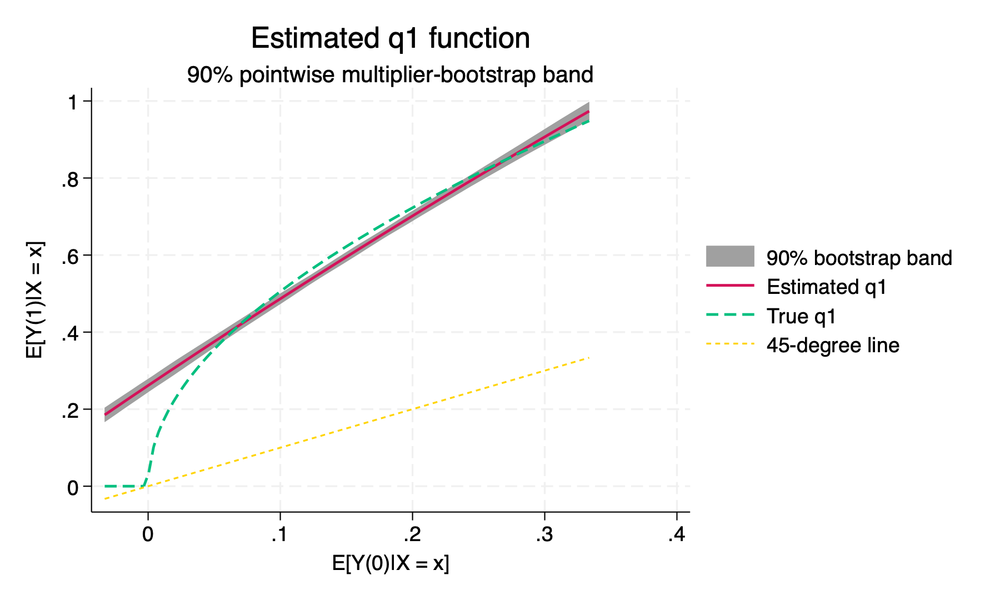
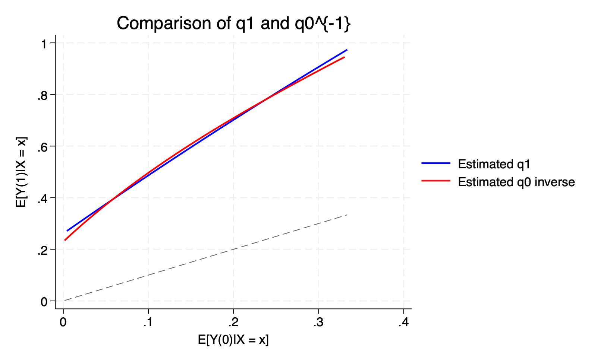
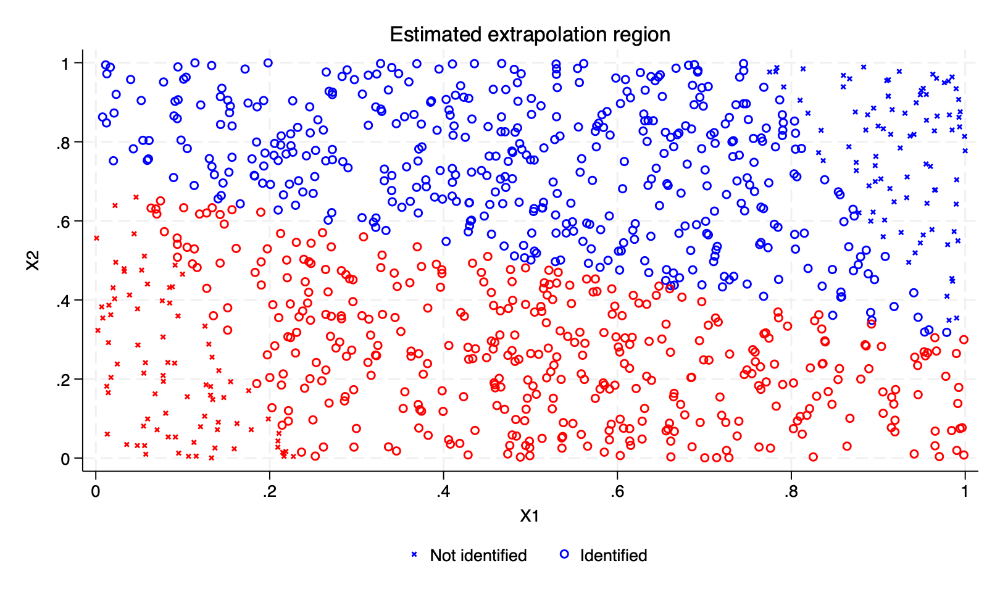

# rdcomono

`rdcomono` implements nonparametric extrapolation in sharp regression discontinuity designs using the comonotonicity approach of Deaner and Kwon (2025).

The package currently provides tools to:

* estimate treated and untreated conditional mean outcome functions using multivariate local polynomial regression;
* estimate the mappings (q_0) and (q_1) between conditional mean potential outcomes;
* determine where conditional average treatment effects are identified;
* construct multiplier-bootstrap confidence bands; and
* estimate the effects of counterfactual treatment policies.

The package requires Stata 17 or later.

## Installation

Clone the repository:

```bash
gh repo clone yubnkm/rdcomonotonicity-stata
```

Then, from Stata, change the working directory to the repository root and add the `src/` directory to the ado-path:

```stata
cd "/path/to/rdcomonotonicity-stata"

adopath ++ "`c(pwd)'/src"
```

You can verify that Stata finds the main command with:

```stata
which rdcomono
```

When developing or running the examples, the `adopath` command only needs to be executed once per Stata session.

## Toy Example

This example generates a two-dimensional sharp RDD in which comonotonicity holds by construction.

It then:

1. estimates the conditional mean potential-outcome mappings;
2. obtains multiplier-bootstrap confidence bands;
3. displays the region where conditional average treatment effects are identified; and
4. estimates the effect of a counterfactual change in the treatment frontier.

The complete example is also available in:

```text
examples/toy_example.do
```

### Data-generating process

Let $$X=(X_1,X_2)$$ be uniformly distributed on the unit square.

Treatment is assigned when

$$
X_2 < 0.7 - 0.4X_1.
$$

The conditional mean treated potential outcome is

$$
g_1(x_1,x_2) = \sin(x_1)+0.3\sin(x_2),
$$

and the conditional mean untreated potential outcome is

$$
g_0(x_1,x_2) = 0.8-0.8\cos{g_1(x_1,x_2)}.
$$

Therefore, $g_0(x)=q_0(g_1(x))$ ,where $q_0(y)=0.8-0.8\cos(y).$ Thus, the two conditional mean potential outcomes are comonotonic.

The following Stata code generates the toy dataset:

```stata
version 17.0
clear all
set more off

adopath ++ "`c(pwd)'/src"

set seed 1
set obs 1000

generate double x1 = runiform()
generate double x2 = runiform()

generate double mu1 = sin(x1) + 0.3*sin(x2)
generate double mu0 = 0.8 - 0.8*cos(mu1)

generate double frontier = 0.7 - 0.4*x1
generate byte D = x2 < frontier

generate double factual_mean = cond(D == 1, mu1, mu0)
generate double y = factual_mean + rnormal(0, 0.02)

label variable x1 "X1"
label variable x2 "X2"
label variable D  "Treatment"
label variable y  "Observed outcome"
```

The treatment rule can be visualized as follows:

```stata
twoway                                                   ///
    (scatter x2 x1 if D == 0,                           ///
        msymbol(Oh) msize(vsmall))                      ///
    (scatter x2 x1 if D == 1,                           ///
        msymbol(+) msize(vsmall))                       ///
    (function y = 0.7 - 0.4*x, range(0 1)              ///
        lwidth(medthick)),                              ///
    title("Toy multivariate RDD")                       ///
    subtitle("Treatment rule: X2 < 0.7 - 0.4 X1")      ///
    xtitle("X1")                                        ///
    ytitle("X2")                                        ///
    xscale(range(0 1))                                  ///
    yscale(range(0 1))                                  ///
    xlabel(0(.2)1)                                      ///
    ylabel(0(.2)1)                                      ///
    legend(order(                                       ///
        1 "Untreated"                                   ///
        2 "Treated"                                     ///
        3 "Frontier"))                                  ///
    name(toy_design, replace)
```



### Estimate the extrapolation model

`rdcomono` estimates the factual conditional mean outcome separately in the treated and untreated regions.

It then uses observations near the treatment frontier to estimate:

* $$q_0$$, which maps a treated conditional mean into the corresponding untreated conditional mean; and
* $$q_1$$, which maps an untreated conditional mean into the corresponding treated conditional mean.


When more than two candidate bandwidths are supplied, the function selects first-stage bandwidths by cross-validation.

```stata
capture frame drop toy_bootstrap

set seed 24680

rdcomono y x1 x2,                         ///
    treatment(D)                          ///
    generate(y0_hat y1_hat supported)     ///
    bandwidth(0.2 0.3 0.4 0.5 0.6)       ///
    kernel(gaussian)                      ///
    folds(5)                              ///
    order(1)                              ///
    bootstrap(100)                        ///
    bootframe(toy_bootstrap)              ///
    bootpoints(100)
```

The variables created by `generate()` are:

| Variable    | Description                       |
| :---------- | :---------------------------------|
| `y0_hat`    | Estimated $$E[Y(0)\mid X]$$       |
| `y1_hat`    | Estimated $$E[Y(1)\mid X]$$       |
| `supported` | Estimated support indicator $$S$$ |

The support indicator `supported` equals one when the observation's factual conditional mean lies within the estimated domain of the relevant counterfactual mapping.

These are the observations for which `rdcomono` extrapolates both conditional mean potential outcomes.

An estimated conditional average treatment effect can therefore be constructed by:

```stata
generate double tau_hat = y1_hat - y0_hat if supported == 1
```

### Multiplier bootstrap

When the `bootstrap()` option is supplied, `rdcomono` applies independent exponential multipliers to the observation weights and re-estimates the model using the bandwidths selected in the original fit.

The following example uses 100 bootstrap draws.
```stata
bootstrap(100)
```

requests 100 bootstrap replications, while

```stata
bootframe(toy_bootstrap)
```

stores the bootstrap results in a Stata frame called `toy_bootstrap`.


```stata
bootpoints(100)
```
requests 100 evaluation points for the $$q_0$$ and $$q_1$$ curves.

### Estimated potential-outcome mappings

`rdcomono_qplot` uses the bootstrap frame generated by `rdcomono` to produce three plots:

1. the estimated $$q_0$$ mapping;
2. the estimated $$q_1$$ mapping; and
3. a comparison of $$\widehat q_1$$ with the inverse relationship implied by $$\widehat q_0$$.

Under comonotonicity, the population versions of $$q_1$$ and $$q_0^{-1}$$ should coincide over their common support.
The shaded regions in the first two figures are 90% pointwise multiplier-bootstrap confidence bands.

```stata
rdcomono_qplot,                         ///
    frame(toy_bootstrap)                ///
    level(90)                           ///
    prefix(toy)
```
#### Mapping from treated to untreated conditional means
```stata
graph display toy_q0
```



#### Mapping from untreated to treated conditional means
```stata
graph display toy_q1
```



#### Comparison of (\widehat q_1) and (\widehat q_0^{-1})
```stata
graph display toy_compare
```



### Region with identified conditional average treatment effects

For two-dimensional assignment variables, `rdcomono_idplot` displays the observations for which the estimated conditional average treatment effect is identified.

Circles indicate observations for which $$S=1$$, while crosses indicate observations for which $$S=0$$.

```stata
rdcomono_idplot x1 x2,                 ///
    treatment(D)                       ///
    support(supported)                 ///
    name(toy_support)
```



The identified region determines which counterfactual treatment policies can be evaluated using the comonotonicity extrapolation method.

A counterfactual policy is fully identified when the treatment changes induced by that policy occur among observations for which the required counterfactual conditional mean potential outcome can be extrapolated.

### Counterfactual policy effect

Consider a counterfactual policy that shifts the treatment frontier upward by 0.05:

$$
D^{\mathrm{counterfactual}} = \mathbf{1} \{ X_2 < 0.7 - 0.4X_1 + 0.05 \}.
$$

This policy expands treatment to observations immediately above the original treatment frontier.

```stata
local delta = 0.05

generate byte D_counterfactual = ///
    x2 < (0.7 - 0.4*x1 + `delta')

label variable D_counterfactual ///
    "Treatment under counterfactual policy"
```

`rdcomono_policy` estimates the mean outcome change generated by replacing the observed treatment rule with the counterfactual policy. The reported effect is averaged over all observations with `supported = 1`, not only over the observations whose treatment status changes.

```stata
rdcomono_policy y,                            ///
    treatment(D)                              ///
    policy(D_counterfactual)                  ///
    y0(y0_hat)                                ///
    y1(y1_hat)                                ///
    support(supported)                        ///
    bootframe(toy_bootstrap)                  ///
    level(90)

scalar policy_estimate = r(estimate)
scalar policy_ci_low = r(conf_low)
scalar policy_ci_high = r(conf_high)
scalar policy_identified_n = r(N_supported)
scalar policy_num_affected = r(num_affected)
scalar policy_affected_share = r(affected_share)
```

The command also reports:

* the number of observations with identified conditional average treatment effects;
* the expected number of observations whose treatment status changes;
* the affected share among identified observations; and
* a multiplier-bootstrap confidence interval when `bootframe()` is supplied.

The returned results can be accessed with:

```stata
return list
```

Important returned scalars include:

| Returned result     | Description                                     |
| :------------------ | :---------------------------------------------- |
| `r(estimate)`       | Estimated counterfactual policy effect          |
| `r(conf_low)`       | Lower endpoint of bootstrap confidence interval |
| `r(conf_high)`      | Upper endpoint of bootstrap confidence interval |
| `r(N_supported)`    | Number of observations with $$S=1$$               |
| `r(num_affected)`   | Expected number affected by the policy          |
| `r(affected_share)` | Affected share among observations with $$S=1$$    |
| `r(bootstrap_reps)` | Number of bootstrap replications                |

Because this is a simulation, the true counterfactual policy effect can also be calculated using the known conditional mean potential outcomes.

For comparison with the estimator, calculate the true effect over the same observations with `supported == 1`:

```stata
generate double true_counterfactual_mean = cond(D_counterfactual == 1, mu1, mu0)

generate double true_policy_change = true_counterfactual_mean - factual_mean if supported == 1

quietly summarize true_policy_change if supported == 1, meanonly

scalar true_policy_effect = r(mean)
```

The estimated and true effects can then be compared with:

```stata
quietly {
	noisily display as text "{text}{hline 62}"
	noisily display as text "Counterfactual policy: frontier shifted upward by 0.05"
	noisily display as text "{text}{hline 62}"
	
    noisily display as text "True policy effect"                 _col(35) ": " as result %10.6f true_policy_effect
    noisily display as text "Estimated policy effect"            _col(35) ": " as result %10.6f policy_estimate
    noisily display as text "90% bootstrap confidence interval"  _col(35) ": [" as result %10.6f policy_ci_low as text ", " as result %10.6f policy_ci_high as text "]"
    
    noisily display as text _newline "Observations with S = 1"     _col(35) ": " as result %10.0f policy_identified_n
    noisily display as text "Number affected by policy"          _col(35) ": " as result %10.0f policy_num_affected
    noisily display as text "Affected share among S = 1"         _col(35) ": " as result %10.4f policy_affected_share
	
	noisily display as text "{text}{hline 62}"

}
```
```text
--------------------------------------------------------------
Counterfactual policy: frontier shifted upward by 0.05
--------------------------------------------------------------
True policy effect                :   0.029379
Estimated policy effect           :   0.029184
90% bootstrap confidence interval : [  0.022410,   0.035959]

Observations with S = 1           :        824
Number affected by policy         :         51
Affected share among S = 1        :     0.0619
--------------------------------------------------------------
```

Although the toy example uses a deterministic counterfactual treatment indicator, `policy()` may also contain treatment probabilities between zero and one.

## Saving the example figures

The figures used in this README can be reproduced after running the example with:

```stata
capture mkdir "output"
capture mkdir "output/toy_example"

graph display toy_design
graph export ///
    "output/toy_example/toy_design.png", ///
    replace width(1800)

graph display toy_q0
graph export ///
    "output/toy_example/toy_q0.png", ///
    replace width(1800)

graph display toy_q1
graph export ///
    "output/toy_example/toy_q1.png", ///
    replace width(1800)

graph display toy_compare
graph export ///
    "output/toy_example/toy_q0_q1.png", ///
    replace width(1800)

graph display toy_support
graph export ///
    "output/toy_example/toy_support.png", ///
    replace width(1800)
```

## Main commands

| Command           | Purpose                                                                                                                             |
| :---------------- | :---------------------------------------------------------------------------------------------------------------------------------- |
| `rdcomono`        | Estimate conditional mean potential outcomes, the (q_0) and (q_1) mappings, and the support indicator (S).                          |
| `rdcomono_qplot`  | Plot (\widehat q_0), (\widehat q_1), bootstrap confidence bands, and the comparison between (\widehat q_1) and (\widehat q_0^{-1}). |
| `rdcomono_idplot` | Plot the identified and unidentified extrapolation regions when there are exactly two assignment variables.                         |
| `rdcomono_policy` | Estimate the effect of a deterministic or probabilistic counterfactual treatment policy.                                            |

Several internal commands support the user-facing commands but are not intended to be called directly:

| Internal command            | Purpose                                         |
| :-------------------------- | :---------------------------------------------- |
| `_rdcomono_localpoly`       | Multivariate local-polynomial regression        |
| `_rdcomono_bootstrap`       | Multiplier-bootstrap controller                 |
| `_rdcomono_bootstrap_refit` | Re-estimation within each bootstrap replication |

## Basic syntax

The main estimator has the form:

```stata
rdcomono outcome x1 x2 [x3 ...],          ///
    treatment(treatment_variable)          ///
    generate(y0_hat y1_hat support)        ///
    bandwidth(numlist)                     ///
    [kernel(gaussian|uniform|triangular)    ///
     folds(#)                              ///
     order(#)                              ///
     bootstrap(#)                          ///
     bootframe(name)                       ///
     bootpoints(#)]
```

The first variable is the outcome.

All remaining variables are assignment variables or covariates (X).

`generate()` must contain exactly three new variable names corresponding to:

```text
estimated E[Y(0)|X]
estimated E[Y(1)|X]
estimated support indicator S
```

The supported kernels are:

```text
gaussian
uniform
triangular
```

## Repository structure

```text
rdcomonotonicity-stata/
|
|-- src/
|   |-- rdcomono.ado
|   |-- rdcomono_qplot.ado
|   |-- rdcomono_idplot.ado
|   |-- rdcomono_policy.ado
|   |-- _rdcomono_localpoly.ado
|   |-- _rdcomono_bootstrap.ado
|   `-- _rdcomono_bootstrap_refit.ado
|
|-- examples/
|   |-- toy_example.do
|   `-- summer_school.do
|
|-- tests/
|
|-- output/
|   |-- toy_example/
|   `-- summer_school/
|
`-- README.md
```

Files whose names begin with `_rdcomono_` are internal implementation commands and are not intended to be part of the user-facing API.

## Reference

The methodology implemented in this package is developed in:

Ben Deaner and Soonwoo Kwon. **“Extrapolation in Regression Discontinuity Design Using Comonotonicity.”** 2025. arXiv:2507.00289.

```bibtex
@article{deanerkwon2025,
  title         = {Extrapolation in Regression Discontinuity Design Using Comonotonicity},
  author        = {Deaner, Ben and Kwon, Soonwoo},
  year          = {2025},
  eprint        = {2507.00289},
  archivePrefix = {arXiv},
  primaryClass  = {econ.EM}
}
```
